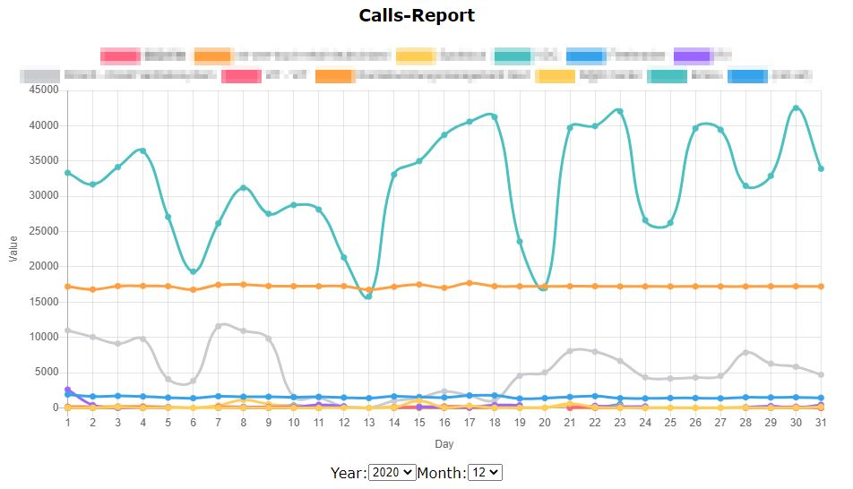

# Description

## Motivation

Current apigee installation is very fragile. A very high amount of our apigee-requests simply times out.

## Approach

To account for the low server resilience and to retrieve usage data, request size was reduced to 20mins slices to have lowst possible load impact on apigee-servers. Those requests are repeated if they fail.

After retrieval, time slices are joined and data is processed and transformed into a format which the frontend understands.

Finally, the frontned visualises it.



## Noteable accomplishments

* git repository is used as low cost data storage
* git `sparse-checkout` allows data storage in same repository
* apigee tokens expire after 30mins. Refreshing tokens means refreshing the csrf-token since apigee has implemented countermeasures against cross-site-request-forgery (csrf)

## Disclaimer

This project is not intended to be run locally but to serve as a compendium and to give inspiration. All company related information has been obscured or anonymized.

## Deployment

### Push to Cloud PaaS

```bash
git clone <repo url>
cd calls-report
cf login
cf push -f cf/manifest-prod.yml && cf logs calls-report
```

### Clone git repo

* Configure POST `/personalaccesstoken` endpoint by providing credentials

```json
   "token": <your token>
```

* post your token
* wait until `/out` folder is replicated

### Process data

* GET `/process` to process the `/out` folder without creating any commits

## Start fetching new apigee-data

> precondition: git repo is cloned

1. Authenticate
   1. Open Chrome
   2. Open Dev Tools in Chrome
   3. Login to ```https://edgeui.apimanager.company.com/platform/internal/apis```
   4. Under networking, retrieve session info by right clicking on an api-request, copy-as, node.js fetch
   5. Send cookie to server
      1. In Postman: paste under POST `/authenticate` endpoint
      2. Paste the content of clipboard as body
      3. Remove unneeded properties and set encapsulating curly brackets to make it a valid json
      4. Server expects object with at least following two properties

    ```json
    {
        "x-apigee-classic-csrf": "string",
        "cookie": "string"
    }
    ```

2. Start
   1. POST `/start`

   ```json
    {
      "from": "2021-03-31",
      "days": 129
    }
    ```

## Observe server logs through cf-cli

Either through cf:

   ```bash
   cf login
   cf logs calls-report
   ```

## Admin UI

* Go to: `https://calls-report.******/logs.html`
* It is also possible to authenticate and start processing through the Admin UI

## Stopping

* GET `/stop` to stop

## Commiting

* GET `/commit` to commit, push and process with one single command

## Environmental variables

Setting: ```cf set-env APP_NAME ENV_VAR_NAME ENV_VAR_VALUE```

Example:

```bash
cf set-env calls-report no_proxy '*.intranet.net, .intranet.net, localhost, .internal, sso-int.company.com, sso.company.com, .--.intranet.net, git.company.com'
cf restage calls-report
```

Through ```manifest.yml```

```yml
---
applications:
  - name: calls-report
    env:
      no_proxy: '*.intranet.net, .intranet.net, localhost, .internal, sso-int.company.com,
      sso.company.com, .--.intranet.net, git.company.com'
```

Getting: ```cf env APP_NAME```

## Endpoints Overview

1. /authenticate
2. /start
3. /stop
4. /out
5. /zip
6. /zips
7. /process
8. /refresh
9. /config
10. /token

## Backlog

### today

* wo habe ich lowdb verwendet? ist es auf github?
* Generalize with .env -> push to github

### prio 3

1. document csrf: how to protect?
2. Refactor betWeen into own endpoint
3. simplify 'go back' algorithm
4. Retry mit while-loop
5. static html page for results
6. re-create the analyze-endpoint -> aggregate by day, week, month
7. store results into git repo
8. use random user agents

```js
const userAgents = ['Mozilla/5.0 (Windows NT 10.0; Win64; x64) AppleWebKit/537.36 (KHTML, like Gecko) Chrome/88.0.4324.104 Safari/537.36'];
```

## Installation cf-cli on your machine

* Install cf-cli v6: [installation guide](https://github.com/cloudfoundry/cli/wiki/V6-CLI-Installation-Guide)
`cf7-cli does not work with this guide`

* add the Cloud Foundry Foundation public key and package repository to your system

```bash
wget -q -O - https://packages.cloudfoundry.org/debian/cli.cloudfoundry.org.key | sudo apt-key add -
echo "deb https://packages.cloudfoundry.org/debian stable main" | sudo tee /etc/apt/sources.list.d/cloudfoundry-cli.list
```

* update your local package index and then install the cf-cli

```bash
sudo apt-get update
sudo apt-get install cf-cli
```

## Setting up the cf-cli

* make sure, you are connected through VPN

* When using UNIX, make sure that proxy is configured properly (i.e. the ```https_proxy``` environmental variable is set)

### Setup API Endpoint & login

* PaaS Demo-Environment, INT, PROD have different endpoints.

```bash
cf api --skip-ssl-validation https://api.intranet.net
cf login
# use same credentials like for login to Apps Manager
```

## SSH

```bash
# check if enabled
cf ssh-enabled paas
# to enable
cf enable-ssh paas
# app needs to be restarted afterwards
cf restart paas
# ssh into it
cf ssh paas
```

## App Health

```bash
cf app calls-report
```
