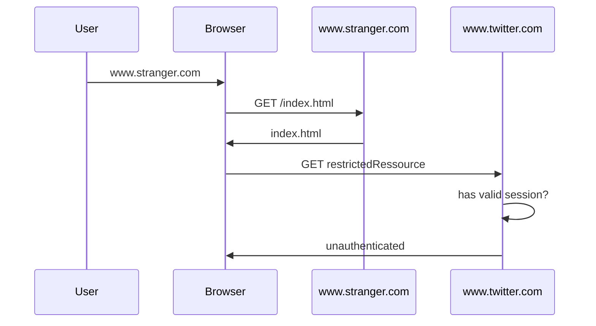
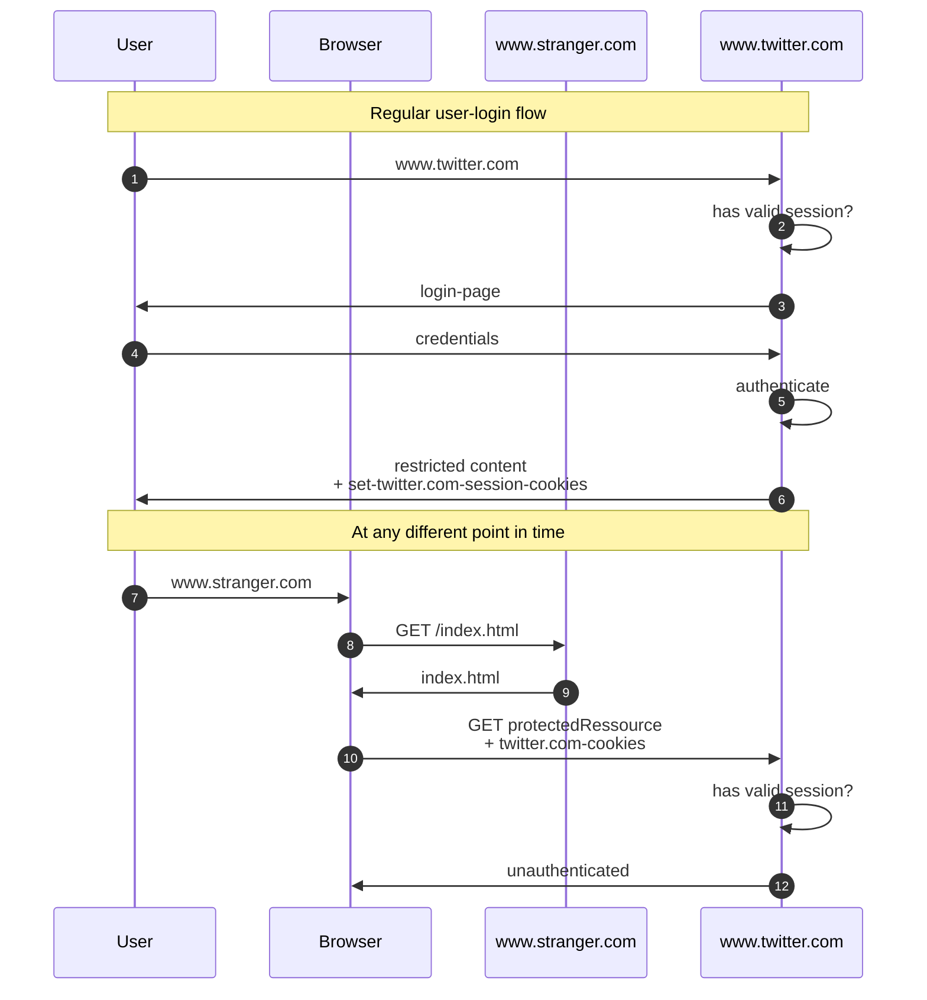

# CSRF

## Unauthenticated Flow



## CSRF Flow



In above example, step ```10``` is the actual ```csrf``` request. The reason, why this works is because browsers take the decision when to send cookies based on 3 criteria:

1. protocol
2. domain
3. port

If all 3 match for any cookie, browser sends that cookie along with the request. This is also and especially true for session-cookies. That is basically how and why sessions work in first place. Without this machanism, users would be required to login on every single navigation step. Also, things like a shopping-cart wouldn't work without. So usually, it's what we actually really depend on.

But attackers can exploit that mechanism as can be seen in the diagram.

## CSRF protection

To close CSRF-vulnerability, traditional cookies-machanism has to be paired with additional protection.
There are different counter measures available, as can be read [here](https://developer.mozilla.org/en-US/docs/Archive/Mozilla/Persona/Security_Considerations).

In general, the solutions are not very simple.
One idea is:

1. let server create additional information and encrypt it with a private key
2. let server send it inside http
3. let server require client to send this information back with every subsequent request inside a header
4. let server validate that information
5. let that information be invalidated after a defined time slot (e.g. 30mins)

The steps can be see below:


